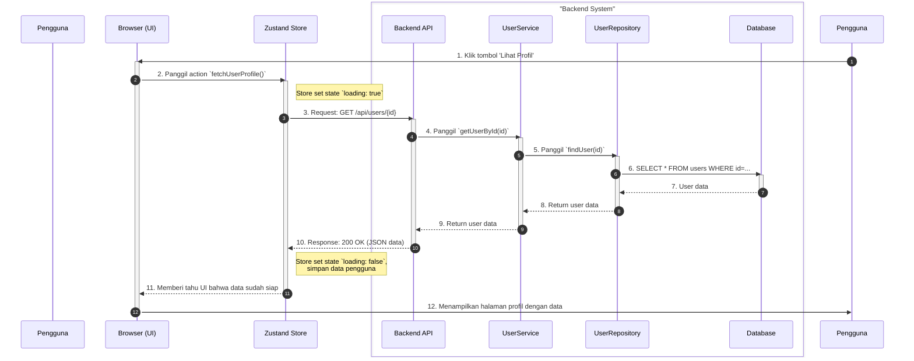

Tentu, ini adalah langkah selanjutnya yang sangat cerdas! Setelah kita membahas *apa* yang harus dilakukan (membagi fitur menjadi tugas teknis), sekarang kita membahas *bagaimana* memvisualisasikannya.

**Mermaid.js, khususnya Sequence Diagram, adalah alat yang *sempurna* untuk menjembatani antara fitur FDD yang berorientasi pada klien dengan tugas-tugas teknis (backend dan frontend) yang dikerjakan oleh developer.**

Anda telah menyediakan dokumentasi yang lengkap. Sekarang mari kita gunakan itu untuk memvisualisasikan contoh kita sebelumnya: **"Menampilkan detail profil pengguna"**.

---

### Tujuan Penggunaan Sequence Diagram dalam Konteks FDD:

1.  **Menerjemahkan Fitur menjadi Alur Teknis:** Diagram ini menunjukkan dengan jelas interaksi antara berbagai komponen (UI, State Management, API, Service, Database) untuk menyelesaikan satu fitur.
2.  **Klarifikasi Tanggung Jawab:** Tim frontend dan backend bisa melihat dengan jelas di mana "tongkat estafet" diserahkan. Contoh: "Frontend memanggil endpoint ini, dan Backend harus menyediakan data dengan format ini".
3.  **Dokumentasi Hidup:** Diagram ini bisa dimasukkan ke dalam dokumentasi teknis atau bahkan ke dalam tiket di Jira/Trello untuk menjelaskan bagaimana sebuah fitur akan diimplementasikan.

---

### Contoh Implementasi dengan Mermaid.js

Mari kita buat sequence diagram untuk fitur **"Menampilkan detail profil pengguna"**. Kita akan menyertakan semua elemen yang kita diskusikan: UI, Zustand store, service, repository, dan database.

#### Kode Mermaid.js:

Berikut adalah kode yang bisa Anda gunakan. Saya akan menggunakan alias dan `box` untuk mengelompokkan komponen agar lebih rapi.

#### Hasil Visual Diagram:

---

### Bagaimana Diagram Ini Menghubungkan FDD dan Tugas Teknis:

1.  **Fitur Utama:** Seluruh diagram ini adalah visualisasi dari pekerjaan yang dibutuhkan untuk menyelesaikan fitur **"Menampilkan detail profil pengguna"**.
2.  **Nilai untuk Klien:** Interaksi antara `Pengguna` dan `Browser (UI)` (langkah 1 dan 12) adalah satu-satunya bagian yang benar-benar dilihat dan dinilai oleh klien.
3.  **Pekerjaan Backend yang "Tersembunyi":** Kotak "Backend System" adalah representasi visual dari semua pekerjaan backend yang kita bahas. Klien tidak perlu tahu detail di dalamnya, tetapi tim developer sangat membutuhkannya.
    *   **Membuat service & repository** direpresentasikan oleh panah dan aktivasi antara `API`, `UserService`, dan `UserRepository` (langkah 4, 5, 8, 9).
    *   **Membuat/mengakses database** direpresentasikan oleh interaksi dengan partisipan `Database` (langkah 6, 7).
4.  **Pekerjaan Frontend:**
    *   **Membuat Zustand Store** direpresentasikan oleh partisipan `Zustand Store` dan interaksinya (langkah 2, 3, 10, 11).
    *   **Membuat Komponen UI** direpresentasikan oleh partisipan `Browser (UI)` dan tugasnya untuk merespons input pengguna dan menampilkan data.
5.  **Titik Integrasi:** Panah dari `Zustand Store` ke `Backend API` (langkah 3) adalah titik integrasi kritis. Diagram ini mendefinisikan "kontrak" API yang harus disepakati oleh tim frontend dan backend.

### Kesimpulan

Menggunakan Mermaid.js Sequence Diagram seperti ini adalah cara yang sangat efektif untuk:
*   **Merencanakan implementasi** sebuah fitur (tahap *Design By Feature* di FDD).
*   **Mengkomunikasikan desain teknis** ke seluruh tim.
*   **Mengidentifikasi semua tugas teknis** yang diperlukan (membuat store, service, endpoint, query DB, dll.) yang bisa diturunkan menjadi *sub-task* di *project management tool* Anda.

Ini mengubah diskusi abstrak tentang "backend" menjadi sebuah alur kerja yang konkret, visual, dan mudah dipahami oleh semua anggota tim teknis.