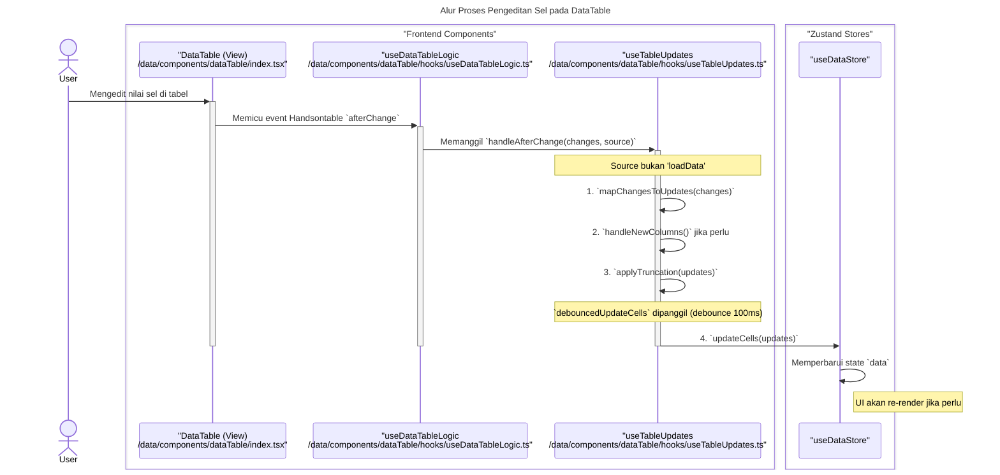
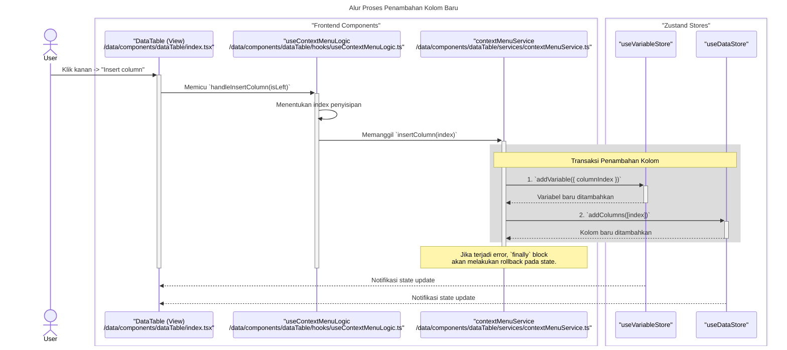
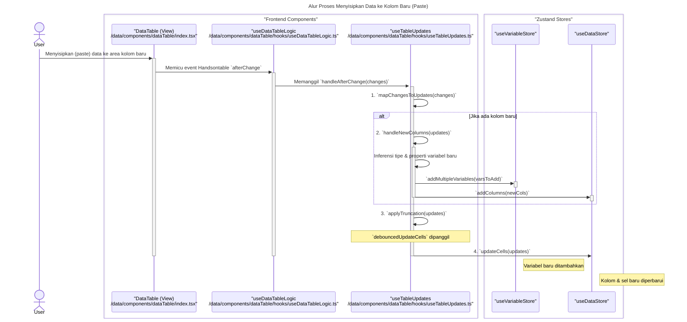

### **Sequence Diagrams: DataTable**

Dokumentasi ini berisi diagram sekuens (sequence diagrams) yang menjelaskan alur kerja utama dan interaksi komponen dalam fitur `DataTable`.

---

### 1. Alur Proses Pengeditan Sel pada DataTable

Diagram ini menunjukkan bagaimana perubahan data oleh pengguna pada satu sel diproses dari antarmuka hingga disimpan dalam state management (Zustand), termasuk mekanisme *debouncing*.

---

### 2. Alur Proses Penambahan Kolom Baru

Diagram berikut menjelaskan proses transaksional saat pengguna menambahkan kolom baru, yang melibatkan pembaruan pada `useVariableStore` dan `useDataStore`.

---

### 3. Alur Proses Menyisipkan Data ke Kolom Baru

Diagram ini mengilustrasikan logika saat pengguna melakukan *paste* data yang mencakup kolom-kolom baru. Sistem akan secara otomatis membuat variabel baru dengan tipe data yang diinferensi.

