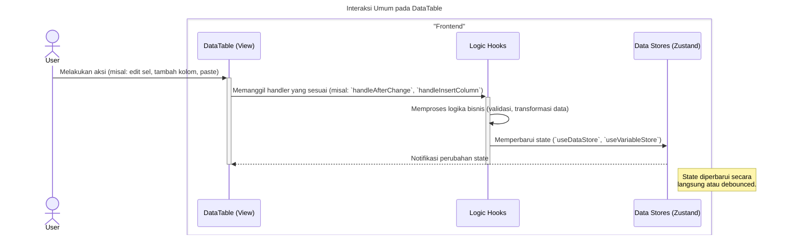
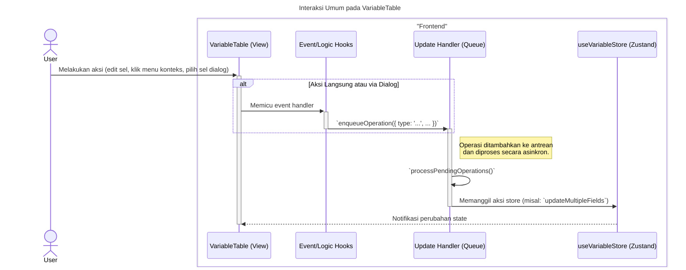
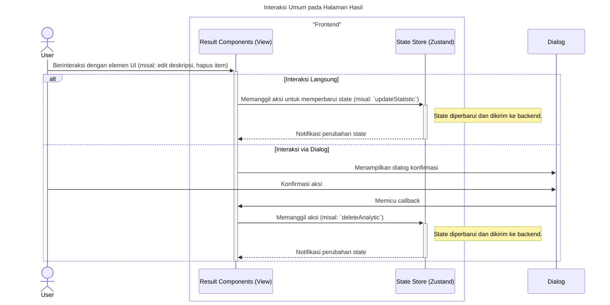

### **Sequence Diagrams: Interaksi Halaman Utama**

Dokumentasi ini berisi generalisasi diagram sekuens (sequence diagrams) yang menjelaskan alur kerja dan interaksi komponen utama pada level halaman, yaitu `DataTable`, `VariableTable`, dan `ResultPage`.

Diagram-diagram ini menyederhanakan beberapa alur spesifik menjadi satu pandangan umum untuk menunjukkan pola interaksi utama.

---

### 1. Interaksi Umum pada DataTable

Diagram ini menggeneralisasi berbagai aksi pengguna pada tabel data (seperti mengedit sel, menambah kolom, atau menyisipkan data) ke dalam satu alur interaksi fundamental.

---

### 2. Interaksi Umum pada VariableTable

Diagram berikut merangkum alur kerja di tabel variabel. Hampir semua aksi (edit langsung, via dialog, atau menu konteks) disalurkan melalui sebuah antrean operasi asinkron untuk memastikan pembaruan state yang teratur.

---

### 3. Interaksi Umum pada Halaman Hasil

Diagram ini mengilustrasikan pola interaksi umum di halaman hasil, di mana pengguna dapat memanipulasi tampilan output (misalnya mengedit deskripsi) atau mengelola daftar analisis (menghapus item).

