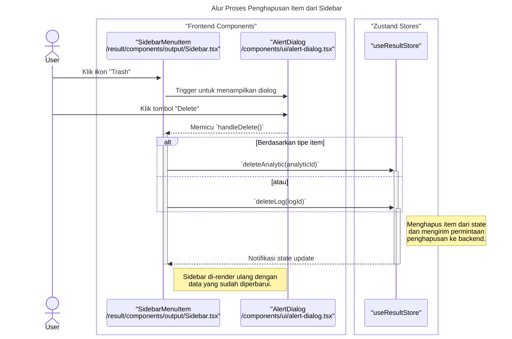

### **Sequence Diagrams: Result Page**

Dokumentasi ini berisi diagram sekuens (sequence diagrams) yang menjelaskan alur kerja utama dan interaksi komponen di Halaman Hasil (`ResultPage`).

---

### 1. Alur Proses Pengeditan Deskripsi Statistik

Diagram ini menunjukkan bagaimana pengguna mengedit deskripsi sebuah hasil statistik, yang kemudian disimpan kembali ke state dan database melalui `useResultStore`.

```mermaid
sequenceDiagram
    title: Alur Proses Pengeditan Deskripsi Statistik
    actor User

    box "Frontend Components"
        participant View as "ResultOutput<br>/result/components/output/ResultOutput.tsx"
        participant Editor as "TiptapEditor<br>/components/Output/Editor/TiptapEditor.tsx"
    end
    
    box "Zustand Stores"
        participant Store as "useResultStore"
    end

    User->>+View: Klik tombol "Edit"
    View->>View: `handleEditClick(statId, description)`
    Note right of View: Set state `editingDescriptionId` & `descriptionValues`
    
    View->>Editor: Kirim props: `editable=true`, `value`, `onSave`
    
    User->>+Editor: Mengubah teks deskripsi
    Editor-->>View: Memicu `onChange(newValue)`
    View->>View: `handleDescriptionChange(statId, newValue)`<br>update state `descriptionValues`
    
    User->>Editor: Klik tombol "Save" di editor
    Editor-->>+View: Memicu `onSave()` -> `handleSaveDescription(statId)`
    
    View->>+Store: `updateStatistic(statId, { description })`
    Note right of Store: State diperbarui & perubahan<br/>disinkronkan ke backend.
    
    Store-->>-View: Notifikasi perubahan state
    deactivate Store
    
    View->>View: Reset state edit
    deactivate View
```

---

### 2. Alur Proses Penghapusan Item dari Sidebar

Diagram berikut menjelaskan alur saat pengguna menghapus sebuah item (misalnya, sebuah Analisis) dari sidebar, termasuk konfirmasi melalui dialog dan pembaruan state.

