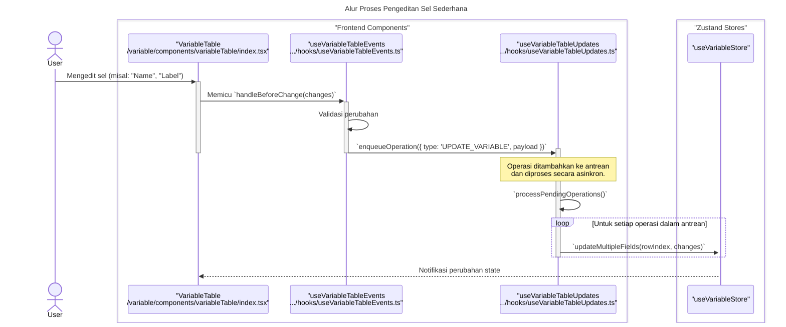
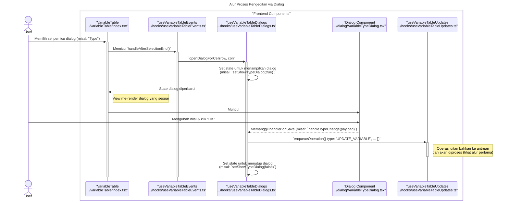
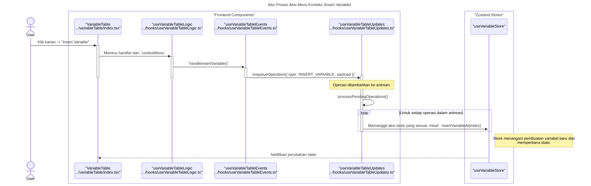

### **Sequence Diagrams: VariableTable**

Dokumentasi ini berisi diagram sekuens (sequence diagrams) yang menjelaskan alur kerja utama dan interaksi komponen dalam fitur `VariableTable` untuk mengelola metadata variabel.

---

### 1. Alur Proses Pengeditan Sel Sederhana

Diagram ini menunjukkan bagaimana perubahan pada sel input sederhana (seperti `Name` atau `Label`) diproses secara asinkron melalui antrean operasi untuk memastikan integritas data.

---

### 2. Alur Proses Pengeditan via Dialog

Diagram berikut menjelaskan proses saat pengguna berinteraksi dengan sel yang memerlukan dialog (seperti `Type`, `Values`, `Missing`), yang juga menggunakan sistem antrean operasi.

---

### 3. Alur Proses Aksi Menu Konteks

Diagram ini mengilustrasikan alur kerja saat pengguna menggunakan menu konteks untuk melakukan aksi seperti "Insert Variable", yang juga diantrekan untuk diproses.

